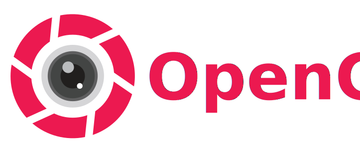

# OpenCams (OpenCFTV) — RTSP Stream Manager 📹



**OpenCams** é um gerenciador de streams de vídeo RTSP profissional, leve e extensível, construído com **Electron**, **Node.js** e **FFmpeg**. Projetado para monitoramento de múltiplas câmeras simultâneas, ele oferece uma interface moderna e recursos avançados para profissionais de CFTV.

## 🚀 Principais Recursos
- **Grid de Câmeras Dinâmico**: Visualize múltiplas câmeras em layouts customizáveis (1x1 a 4x4).
- **Servidor de Mosaico (Web Server)**: Exponha um mosaico de câmeras para acesso via rede local através de um navegador (Porta padrão: `2323`).
- **Escuta de Áudio (Listen)**: Suporte exclusivo para extração de áudio unidirecional (PCM 16kHz) via processos FFmpeg isolados.
- **Probe Camera**: Scanner de rede automático para descoberta de câmeras RTSP na sua rede local.
- **Snapshots**: Capture imagens instantâneas das suas câmeras com um clique.
- **Persistência Local**: Configurações salvas de forma segura em banco de dados SQLite local.
- **Design Moderno**: Interface em modo escuro com estética **Glassmorphism** e animações suaves.

## 🛠️ Requisitos
- **Node.js**: v18 ou superior.
- **FFmpeg**: Instalado em seu sistema (PATH ou Homebrew no Mac).
- **macOS (M1/M2/M3)**: Suporte nativo para arquitetura Apple Silicon.

## 📦 Instalação e Uso
Para rodar em ambiente de desenvolvimento:
```bash
npm install
npm run dev
```

Para gerar os executáveis de produção (Build):
```bash
npm run build
```
Os arquivos gerados estarão na pasta `dist/`.

## 📚 Documentação SDD (Spec-Driven Development)
Este projeto segue a metodologia **Spec-Driven Development**, onde as especificações são a fonte da verdade antes da implementação.

- **[Especificação de Projeto](documentations/PROJECT_SPEC.md)**: Detalhamento funcional e de domínio.
- **[Especificação de Arquitetura](documentations/ARCHITECTURE_SPEC.md)**: Blueprint técnico e contratos IPC.
- **[Guia de Build](documentations/BUILD.md)**: Como compilar e distribuir em Windows, Mac e Linux.
- **[Diretrizes AI (CLAUDE.md)](CLAUDE.md)**: Regras de ouro para agentes de IA operando neste repositório.

## 🤝 Contribuição
1. Edite as especificações em `documentations/`.
2. Implemente a funcionalidade no `Main` ou `Renderer`.
3. Valide contra os contratos de IPC definidos.

---
© 2026 Jaccon Lab